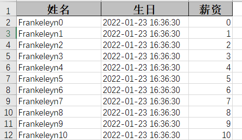
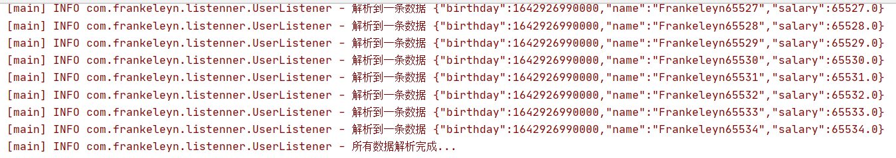

# EasyExcel


## 一、简介

### 1、官方网站

项目地址：https://github.com/alibaba/easyexcel

快速开始：https://www.yuque.com/easyexcel/doc/easyexcel


### 2、EasyExcel特点

- Java 领域解析、生成 Excel 比较有名的框架有 Apache poi、jxl 等。但他们都存在一个严重的问题就是非常的耗内存。如果你的系统并发量不大的话可能还行，但是一旦并发上来后一定会 OOM 或者 JVM 频繁的 full gc。
- EasyExcel 是阿里巴巴开源的一个 excel 处理框架，**以使用简单、节省内存著称**。EasyExcel 能大大减少占用内存的主要原因是在解析 Excel 时没有将文件数据一次性全部加载到内存中，而是从磁盘上一行行读取数据，逐个解析。
- EasyExcel 采用一行一行的解析模式，并将一行的解析结果以观察者的模式通知处理（AnalysisEventListener）。


## 二、使用 EasyExcel 读写 Excel

### 1. 创建项目

创建一个普通 **Maven 项目**

项目名：**alibaba-easyexcel**


### 2. 引入 pom 依赖

```xml
<dependencies>

    <dependency>
        <groupId>com.alibaba</groupId>
        <artifactId>easyexcel</artifactId>
        <version>2.1.7</version>
    </dependency>

    <dependency>
        <groupId>org.slf4j</groupId>
        <artifactId>slf4j-simple</artifactId>
        <version>1.7.5</version>
    </dependency>

    <dependency>
        <groupId>org.apache.xmlbeans</groupId>
        <artifactId>xmlbeans</artifactId>
        <version>3.1.0</version>
    </dependency>

    <dependency>
        <groupId>org.projectlombok</groupId>
        <artifactId>lombok</artifactId>
        <version>1.18.12</version>
    </dependency>

    <dependency>
        <groupId>junit</groupId>
        <artifactId>junit</artifactId>
        <version>4.12</version>
    </dependency>
    
    <dependency>
        <groupId>com.alibaba</groupId>
        <artifactId>fastjson</artifactId>
        <version>1.2.78</version>
    </dependency>

</dependencies>
```


### 3.写

#### ① 创建实体类

```java
package com.frankeleyn.pojo;

/**
 * @author Frankeleyn
 * @date 2022/1/23 16:26
 */
@Data
public class User {

    @ExcelProperty("姓名")
    private String name;

    @ExcelProperty("生日")
    private Date birthday;

    @ExcelProperty("薪资")
    private Double salary;
}
```


#### ② 新建测试类

```java
package com.frankeleyn.easyexcel;

/**
 * @author Frankeleyn
 * @date 2022/1/23 16:27
 */
public class EasyExcelTest {

    private String filename = "E:/WorkSpace/alibaba-easyexcel/write.xlsx";

    @Test
    public void testWrite() throws IOException {
        EasyExcel.write(filename, User.class).sheet("模板").doWrite(data());
    }

    // 写入的数据
    public List<User> data() {
        List<User> userList = new ArrayList<>();
        for (int i = 0; i < 65535; i++) {
            User user = new User();
            user.setName("Frankeleyn" + i);
            user.setBirthday(new Date());
            user.setSalary(Double.valueOf(i));
            userList.add(user);
        }
        return userList;
    }
}
```


#### ③ 运行结果




#### 写入大数据量

xls 版本的Excel最多一次可写0 ...65535行

xlsx 版本的Excel最多一次可写0...1048575行


### 4. 读

#### ① 创建监听器

```java
package com.frankeleyn.listenner;

/**
 * @author Frankeleyn
 * @date 2022/1/23 16:46
 */
@Slf4j
public class UserListener extends AnalysisEventListener<User>  {
    @Override
    public void invoke(User data, AnalysisContext context) {
        log.info("解析到一条数据 {}", JSON.toJSONString(data));
    }

    @Override
    public void doAfterAllAnalysed(AnalysisContext context) {
        log.info("所有数据解析完成...");
    }
}
```

#### ② 创建测试方法

在 **EasyExcelTest** 中添加读的测试方法

```java
@Test
public void testRead() {
    EasyExcel.read(filename,User.class,new UserListener()).sheet().doRead();
}
```

#### ③ 运行结果



